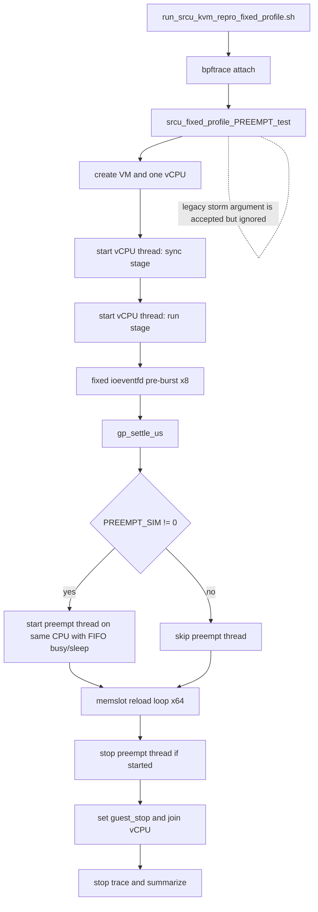

# kvm-srcu fixed profile kit (PREEMPT default)

This README documents the default fixed-profile flow driven by `run_srcu_kvm_repro_fixed_profile.sh`.
The runner always uses `srcu_fixed_profile_PREEMPT_test`.
The legacy storm-thread model is preserved in `srcu_fixed_profile_storm_test.c` for optional standalone use.

## 1) Goal

This kit reproduces and profiles behavior on a single `kvm->srcu`, focusing on:
- memslot reload behavior on the expedited side;
- long-tail `kvm_reader_ge_1ms` samples;
- ge1 attribution by scheduler and interrupt context (`sched_switch` / irq / softirq).

## 2) Current model (trimmed PREEMPT path)

### End-to-end flow


### Notes
- The runner is pinned to `srcu_fixed_profile_PREEMPT_test`.
- The CLI `storm` argument is accepted only for backward compatibility and is ignored in the PREEMPT model.
- `PREEMPT_SIM=0/1` controls whether the preemption thread is enabled.

## 3) Fixed parameters

- `reloads=64`
- `spin_duration_ms=8000`
- `gp_settle_us=5000`
- `ioeventfd pre-burst=8`
- `ioeventfd interval_us=200`
- Preemption thread (when enabled): `cpu=0 fifo_prio=50 busy_us=800 sleep_us=50`

## 4) Build and run

```bash
cd tools/testing/selftests/kvm
make -j"$(nproc)" srcu_fixed_profile_PREEMPT_test

# The runner still passes the legacy storm argument, but PREEMPT ignores it.
PREEMPT_SIM=0 POST_RUN_SETTLE_S=40 bash ./run_srcu_kvm_repro_fixed_profile.sh 1
PREEMPT_SIM=1 POST_RUN_SETTLE_S=40 bash ./run_srcu_kvm_repro_fixed_profile.sh 1
```

## 5) Historical results

### A) After redundancy cleanup: off 10 + on 10
Output directory:
`/data/ct/home/wanglian/my-next/Documentation/RCU/fixed-cleanup-compare-10x-20260422-220619`

- `PREEMPT_SIM=0` (10 runs): `ge1_total=0`, `sw_total=0`, `irq_total=0`, `softirq_total=0`
- `PREEMPT_SIM=1` (10 runs): `ge1_total=270`, `sw_total=270`, `irq_total=0`, `softirq_total=1`

Conclusion: cleanup did not change the separation trend. Ge1 is near-zero with preemption off, and stable with preemption on, mostly attributed to `sched_switch`.

### B) After shrinking C file to 189 lines: off 3 + on 3
Output directory:
`/data/ct/home/wanglian/my-next/Documentation/RCU/fixed-compact-3x-20260422-223616`

- `PREEMPT_SIM=0` (3 runs): `ge1_total=1`, `sw_total=1`, `irq_total=0`, `softirq_total=1`, `call_main~205-206`, `memslot~192-193`, `ioeventfd=13`
- `PREEMPT_SIM=1` (3 runs): `ge1_total=66`, `sw_total=66`, `irq_total=0`, `softirq_total=2`, `call_main=206`, `memslot=194`, `ioeventfd=12`

Conclusion: the compact model still shows clear preemption on/off separation. A single ge1 point in the off group is an occasional tail event.

### C) Runner pinned to PREEMPT binary: off 10 + on 10 (current baseline)
Output directory:
`/data/ct/home/wanglian/my-next/Documentation/RCU/fixed-preempt-only-10x-20260422-231205`

- Condition: `POST_RUN_SETTLE_S=40`, legacy `storm=1` argument kept for compatibility, binary is `srcu_fixed_profile_PREEMPT_test`.
- `PREEMPT_SIM=0` (10 runs): `ge1_total=2`, `sw_total=2`, `irq_total=0`, `softirq_total=1`; 9 runs had `ge1=0`, run #10 had `ge1=2`.
- `PREEMPT_SIM=1` (10 runs): `ge1_total=235`, `sw_total=235`, `irq_total=0`, `softirq_total=0`; per-run `ge1` was roughly `17-34`, with `call_main=206`, `memslot` mostly `194`, and `ioeventfd` mostly `12`.

Conclusion: with runner pinned to the PREEMPT binary, enabling preemption still strongly increases ge1, while the off case remains near-zero except rare tail points.

### D) Updated PREEMPT model rerun: off 5 + on 5
Output directory:
`/data/ct/home/wanglian/my-next/Documentation/RCU/fixed-preempt-only-5x-20260423-092404`

- Condition: updated `srcu_fixed_profile_PREEMPT_test.c` (English comments and dead-path cleanup), `POST_RUN_SETTLE_S=40`, legacy `storm=1` argument kept for compatibility.
- `PREEMPT_SIM=0` (5 runs): `ge1_total=0`, `sw_total=0`, `irq_total=0`, `softirq_total=0`
- `PREEMPT_SIM=1` (5 runs): `ge1_total=130`, `sw_total=130`, `irq_total=0`, `softirq_total=0`; per-run `ge1` was `29, 25, 23, 26, 27`

Conclusion: after the PREEMPT source cleanup, the separation remains stable: preemption-off stays at zero ge1, while preemption-on consistently reproduces scheduler-attributed ge1 events.

## 6) This cleanup includes

- `srcu_fixed_profile_PREEMPT_test.c` trimmed to 179 lines;
- `srcu_kvm_fixed_profile_test.c` renamed to `srcu_fixed_profile_storm_test.c`;
- storm-thread path removed from PREEMPT model (fixed pre-burst only);
- `run_srcu_kvm_repro_fixed_profile.sh` uses PREEMPT binary directly;
- both `srcu-kvm-bpftrace-callsite.bt` copies dropped the unused map `@reader_curr_cpu`.

## 7) Archive files

- `srcu_fixed_profile_PREEMPT_test.c`
- `srcu_fixed_profile_storm_test.c`
- `run_srcu_kvm_repro_fixed_profile.sh`
- `srcu-kvm-bpftrace-callsite.bt`
- `srcu-kvm-fixed-profile-readme.md`
