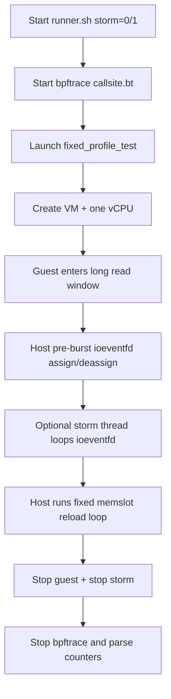

# kvm-srcu-test

## 1) What This Package Does
This package reproduces and profiles interaction on the same `kvm->srcu` between:
- normal-side pressure (`ioeventfd` path, `call_srcu` related), and
- memslot reload side (expedited synchronization related).

It provides one fixed test model and one runner for repeatable collection

## 2) Global Architecture and Run Logic

### Flow Diagram



### Runtime Steps

1. Runner starts `srcu-kvm-bpftrace-callsite.bt`.
2. Test creates one VM and one vCPU.
3. Guest enters a long read-side busy window.
4. Host emits fixed pre-burst `ioeventfd` operations.
5. If `storm=1`, an extra host thread keeps injecting `ioeventfd` pressure.
6. Host performs fixed-count memslot reload operations.
7. Runner stops tracing and prints key counters.

## 3) Fixed Parameters: Meaning and Why

- `reloads=64`: number of memslot reload requests per run.
- `spin_duration_ms=8000`: keeps guest read window long enough for overlap.
- `gp_settle_us=5000`: allows early normal GP activity before reload loop.
- `ioeventfd_repeats=8`: fixed pre-burst pressure before reload loop.
- `ioeventfd_interval_us=200`: spacing inside pre-burst, avoids burst collapse.
- `pre_memslot_io_burst=8`: aligns callsite sampling with same-VM ordering.
- `storm_rounds=12000` (`storm=1` only): strong extra normal-side pressure.

Parameter set is chosen from repeated stable runs to maximize reproducibility and keep runtime practical.

## 4) Build and Run

```bash
cd tools/testing/selftests/kvm
make -j"$(nproc)" srcu_kvm_fixed_profile_test

# storm off
POST_RUN_SETTLE_S=45 bash run_srcu_kvm_repro_fixed_profile.sh 0

# storm on
POST_RUN_SETTLE_S=45 bash run_srcu_kvm_repro_fixed_profile.sh 1
```

## 5) Output and Interpretation

- Main outputs: `selftest.stdout` and `bpftrace.out`.
- Compare `@call_ioeventfd_cnt` and `@call_main_cnt` between `storm=0` and `storm=1`.
- Reader long-tail evidence: `@kvm_reader_ge_1ms`, `@kvm_reader_ge_4ms`.


